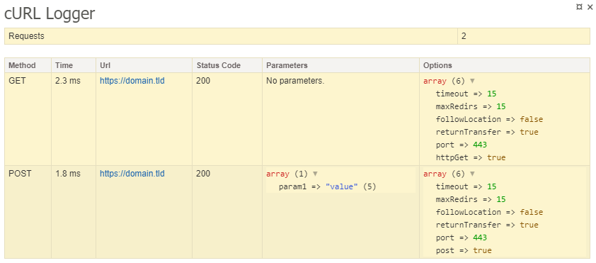

# curl
This extension for [Nette Framework](https://nette.org/) is simple cURL PHP wrapper for sending HTTP requests. It requires curl extension enabled.
### Installation
To get the latest version of cURL extension, simply require the project using [Composer](https://getcomposer.org/):
```sh
$ composer require ymastersk/curl
```
Neon configuration:
```neon
extensions:
  curl: ymastersk\Curl\DI\CurlExtension
```
### Configuration
This configuration is optional.
```neon
curl:
  debugger: %debugMode%
  options:
    option: value
  headers:
    header: value
  cookies:
    cookie: value
```
If you enable `debugger`, then all requests will be logged in the Tracy. It's enabled by default.



`options`, `headers` and `cookies` are set globally and sent for each request.
You can setup or change every option that is listed [here](https://www.php.net/curl_setopt), for example:
```neon
options:
  maxRedirs: 10
```
This sets `CURLOPT_MAXREDIRS` to 10.
### Usage
For sending requests, we need `ymastersk\Curl\CurlClient`. It's created by Dependency Injection, so we can use it easily, for example like this:
```php
public function __construct(ymastersk\Curl\CurlClient $curlClient){
  $curlClient->...;
}
```
#### Basic requests
The response is always instance of `ymastersk\Curl\Http\Response`. URL can be `string`, `Nette\Http\Url` or `Nette\Http\UrlImmutable`. 
```php
$response = $curlClient->request(ymastersk\Curl\Http\Request::GET, 'https://domain.tld')->send();
```
This sends GET request and returns Response instance.
#### Shortcuts
```php
$get = $curlClient->get('https://domain.tld')->send(); // Sends GET request.
$post = $curlClient->post('https://domain.tld', ['name' => 'value'])->send(); // Sends POST request with post parameter 'name' with value 'value'. 
$head = $curlClient->head('https://domain.tld')->send(); // Sends HEAD request.
$put = $curlClient->put('https://domain.tld', ['name' => 'value'])->send(); // Sends PUT request with parameter 'name' with value 'value'. 
$patch = $curlClient->patch('https://domain.tld', ['name' => 'value'])->send(); // Sends PATCH request with parameter 'name' with value 'value'. 
$delete = $curlClient->delete('https://domain.tld', ['name' => 'value'])->send(); // Sends DELETE request with parameter 'name' with value 'value'. 
```
### Response
Each sent request returns an instance of `ymastersk\Curl\Http\Response`.
```php
$response->getBody(); // Returns instace of ymastersk\Curl\Http\ResponseBody or raw response body.
$response->getCode(); // Returns HTTP status code.
$response->getVersion(); // Returns the version used in the HTTP connection.
$response->getScheme(); // Returns the URL scheme used for the request.
$response->getTime(); // Returns total transaction time in milliseconds for transfer.
$response->getHeaders(); // Returns array of response HTTP headers.
$response->getHeader($name); // Returns value of response header. If not exists returns null.
$response->getRequestHeaders(); // Returns array of request HTTP headers.
$response->getRequestHeader($name); // Returns value of request header. If not exists returns null.
```
##### ResponseBody
You can easily decode JSON:
```php
$json = $response->getBody()->decodeJson();
```
This function accepts flag `Nette\Utils\Json::FORCE_ARRAY`.

Or you can easily convert body to `DOMDocument` instance:
```php
$dom = $response->getBody()->toDom();
```
#### Options
You can setup or change every option that is listed [here](https://www.php.net/curl_setopt).
##### Setting up global options:
```php
$curlClient->setOption('maxRedirs', 10); // CURLOPT_MAXREDIRS
```
Or from the array:
```php
$curlClient->setOptions(['maxRedirs' => 10, ...]);
```
##### Setting up options for request:
```php
$request = $curlClient->get('https://domain.tld');
$request->setOption(maxRedirs, 10); // CURLOPT_MAXREDIRS
```
Or from the array:
```php
$request->setOptions(['maxRedirs' => 10, ...]);
```
#### Headers
##### Setting up global headers:
```php
$curlClient->setHeader('Token', 'abcdefgh');
```
Or from the array:
```php
$curlClient->setHeaders(['Token' => 'abcdefgh', ...]);
```
##### Setting up headers for request:
```php
$request = $curlClient->get('https://domain.tld');
$request->setHeader('Token', 'abcdefgh');
```
Or from the array:
```php
$request->setHeaders(['Token' => 'abcdefgh', ...]);
```
#### User Agent
You can also easily set User Agent, default User Agent is: `ymastersk/curl (compatible; +https://ymastersk.net)` and there are even some default User Agents:
| Constant | Value |
| -------- | ----- |
| `ymastersk\Curl\Http\Request::USERAGENT_CHROME` | `Mozilla/5.0 (X11; Linux x86_64) AppleWebKit/537.36 (KHTML, like Gecko) Chrome/83.0.4103.61 Safari/537.36` |
| `ymastersk\Curl\Http\Request::USERAGENT_OPERA` | `Mozilla/5.0 (X11; Linux x86_64) AppleWebKit/537.36 (KHTML, like Gecko) Chrome/83.0.4103.61 Safari/537.36 OPR/68.0.3618.125` |
| `ymastersk\Curl\Http\Request::USERAGENT_FIREFOX` | `Mozilla/5.0 (X11; Linux i686; rv:76.0) Gecko/20100101 Firefox/76.0` |
| `ymastersk\Curl\Http\Request::USERAGENT_GOOGLEBOT` | `Mozilla/5.0 (compatible; Googlebot/2.1; +http://www.google.com/bot.html)` |

For all requests:
```php
$curlClient->setUserAgent($userAgent);
```
For request:
```php
$request->setUserAgent($userAgent);
```
#### Cookies
##### Setting up global cookies:
```php
$curlClient->setCookie('sid', 'abcdefgh');
```
Or from the array:
```php
$curlClient->setCookies(['sid' => 'abcdefgh', ...]);
```
##### Setting up cookies for request:
```php
$request = $curlClient->get('https://domain.tld');
$request->setCookie('sid', 'abcdefgh');
```
Or from the array:
```php
$request->setCookies(['sid' => 'abcdefgh', ...]);
```
### Other options
These options work globally for all requests, but also for a given request.
```php
setSslVersion(int $version) // Sets SSL version.
setSslCipherList(string $cipherList) // Sets SSL cipher list.
setCertificationVerify(bool $value = true) // Sets if all certificates are trusted by default.
setTrustedCertificate(string $certificate, int $verify = ymastersk\Curl\Http\Request::VERIFY_MATCH) // Sets path to the trusted certificate.
setTrustedCertificatesDirectory(string $directory, int $verify = ymastersk\Curl\Http\Request::VERIFY_MATCH) // Sets path to directory which contains trusted certificates.
```
##### Verify host values
| Constant | Description |
| -------- | ----------- |
| `ymastersk\Curl\Http\Request::VERIFY_NO` | Does not check the common name attribute. |
| `ymastersk\Curl\Http\Request::VERIFY_COMMON` | Checks that the common name attribute at least exists. |
| `ymastersk\Curl\Http\Request::VERIFY_MATCH` | Checks that the common name exists and that it matches the host name of the server. |